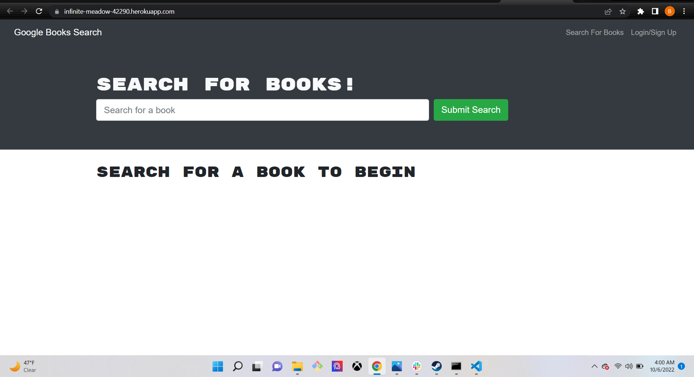

# Book Search Engine 

## Description

Allows a user to signup and login to search for books and save them to be viewed later

## Table of Contents

- [Installation](#Installation)

- [Usage](#Usage)

- [License](#License)

- [Contributing](#Contributing)

- [Tests](#Tests)

- [Questions](#Questions)

## Installation

from root of correct directory npm install, otherwise the application is deployed

## Usage

login/signup search for books, save interesting books for later

Here is an example video demonstrating how to use the application:

## License

This application is covered by : ISC

## Contributing

Below are my guidelines on how you can contribute to my project

If you would like to contribute please fork the repo and request a pull, i would be happy to review the contribution

## Tests

no tests

### Questions

Here is my GitHub page: [https://github.com/BradsW90](https://github.com/BradsW90)

To my deployed application: [http://infinite-meadow-42290.herokuapp.com]

If you would like to contact me with questions, ideas, or ways you would improve the project please click the link below!

My Email: [bswj90@gmail.com](mailto:bswj90@gmail.com)
